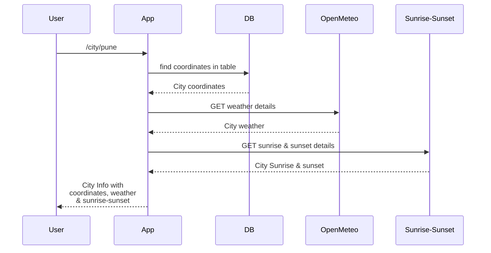
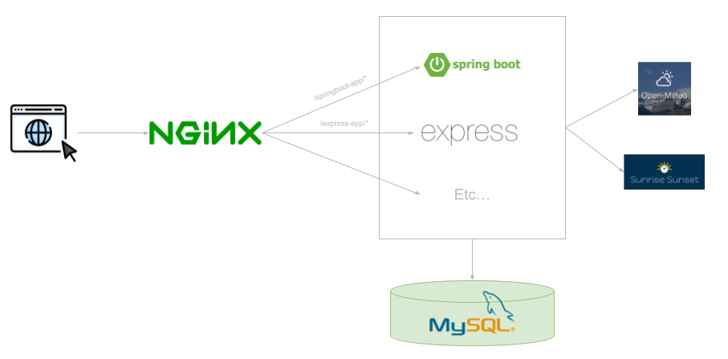

# ways-to-create-rest-apis

## What is this ?

This repository contains some ways to create REST APIs. There a lot of ways to implement REST APIs, with help of different programming languages & frameworks. But this repo includes some of the ways. 

If you know a way to implement REST API which is not included in this repo, please feel free to contribute through PRs.

## What is implemented ?

In the sample API implementation, a query to DB & getting data from external APIs is included.

In this sample, latitude & longitude of a city is fetched from DB & it's sunrise-sunset times & current weather is fetched from external free APIs.

## Implementation details

The REST APIs are implemented in dfferent languages and frameworks. The language or framework specific details will be included in the language or framework specific README files if something specific is to be mentioned.

This README explans the general implementation. 

The imeplementation in all the languages & frameworks is the same. For a given city, latitude & longitude of a city is fetched from DB & it's sunrise-sunset times & current weather is fetched from external free APIs. 

There is no specific purpose of this implementation, other than having a generic example implementation. This implementation is chosen because in most of the REST API implementations, we deal with database queries and external API calls. There are other things involved as well, with even more complexity, but this implemenation is kept simple, so that a new developer starting with some language or framework should not get overwhelmed. Once a developer is comfortable, I'm sure that developer will be able to feagure out the proper solution implementation details, may that be complex DB queries, NoSQL queries, message queue etc.

Following sequence diagram shows API execution - 

It is simple. It does not include any authentication or any other middlewares. 

### Setup -

There are different REST APIs included in this repo. All doing the same thing. 

All the REST APIs fetch city coordinates from the MySQL database. For this, we have setup a MySQL docker with 2 city coordinates. 

We are also calling 2 external free APIs. Openmeteo for basic weather details. And SunriseSunset for sunrise & sunset details. There is no specific logic for choosing these 2, other than these are free public APIs, and we can use this for example implementation.

All the servers are running in the docker container. We can directly call the servers for APIs, but we also have NGINX server setup to access all these servers. Specific address for each of the server are mentioned later in this document.

Following diagram gives a good view of how the API is setup -

#### Database setup

For the demo purpose, MySQL is used as database server. You can make changes are per your database requirements.

1. Run just the MYSQL through docker
   `docker run --name sample-api-mysql -p 3306:3306 -e MYSQL_ROOT_PASSWORD=root -d mysql:latest`

2. Import dump present in this repo

We can run the server through docker compose as well, which will import the data as well in the DB.

For the database & docker ports, a `.env` file is included. Please update the same if you have different credentials, or you want to change the ports.

## Running the project

We can run the specific server locally. Make sure you are running MySQL server before running the API server. The server specific execution details will be included in the language or framework specific README files if something specific is to be mentioned. 

This README includes execution of all the servers at once using docker.

To run complete setup in docker -
`docker compose -f setup/docker-compose.yml up --force-recreate -d`

You can access each of the APIs with URLs as mentioned in the table below.

| Sr | Language   | Framework   | Example URL while running locally                    | Example URL to access through Docker                 | Example URL to access through NGINX                              |
|----|------------|-------------|------------------------------------------------------|------------------------------------------------------|------------------------------------------------------------------|
| 1  | Java       | Spring Boot | http://localhost:8080/city/pune                      | http://localhost:8080/city/pune                      | http://localhost:80/springboot-app/city/pune                     |
| 2  |            | Spring MVC  | http://localhost:8080/sample-springmvc-api/city/pune | http://localhost:8081/sample-springmvc-api/city/pune | http://localhost:80/springmvc-app/sample-springmvc-api/city/pune |
| 3  | JavaScript | ExpressJS   | http://localhost:3000/city/pune                      | http://localhost:3000/city/pune                      | http://localhost:80/express-app/city/pune                        |
| 4  | Go         | Gin         | http://localhost:8080/city/pune                      | http://localhost:8082/city/pune                      | http://localhost:80/gin-app/city/pune                            |
| 5  | Python     | FastAPI     | http://localhost:8000/city/pune                      | http://localhost:8000/city/pune                      | http://localhost:80/fastapi-app/city/pune                        |

## Current API implementation status

| Sr | Language   | Framework   | GET | POST | PUT | DELETE |
|----|------------|-------------|-----|------|-----|--------|
| 1  | Java       | Spring Boot | Y   | Y    | Y   | Y      |
| 2  | Java       | Spring MVC  | Y   | -    | -   | -      |
| 3  | JavaScript | ExpressJS   | Y   | -    | -   | -      |
| 4  | Go         | Gin         | Y   | Y    | -   | -      |
| 5  | Python     | FastAPI     | Y   | -    | -   | -      |

## Other status

| Sr | Language   | Framework   | Unit tests | Swagger Docs                                | Logging     |
|----|------------|-------------|------------|---------------------------------------------|-------------|
| 1  | Java       | Spring Boot | Y          | /swagger-ui/index.html                      | Only errors |
| 2  | Java       | Spring MVC  | Y          | /sample-springmvc-api/swagger-ui/index.html | Only errors |
| 3  | JavaScript | ExpressJS   | Y          | /swagger-ui/                                | -           |
| 4  | Go         | Gin         | Y          | -                                           | Only errors |
| 5  | Python     | FastAPI     | -          | /docs                                       | -           |
