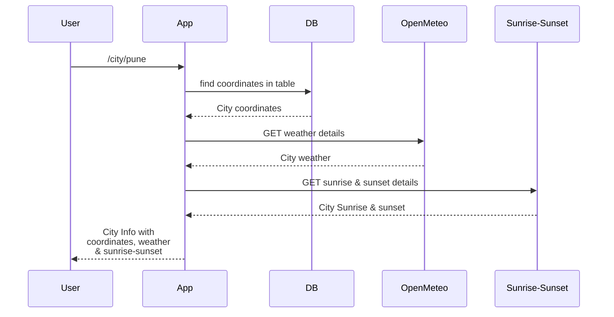

# ways-to-create-rest-apis

## What is implemented

In the sample API implementation, a query to DB & getting data from external APIs is included.

In this sample, latitude & longitude of a city is fetched from DB & it's sunrise-sunset times & current weather is fetched from external free APIs.

## Database

For the demo purpose, MySQL is used as database server. There is no logic behind choosing this server, it's chosen randomly. You can make changes are per your database.

1. Run MYSQL through docker
   `docker run --name sample-api-mysql -p 3306:3306 -e MYSQL_ROOT_PASSWORD=root -d mysql:latest`

2. Import dump present in this repo

## Setup

To run complete setup -
`docker compose -f setup/docker-compose.yml up --force-recreate -d`

### Current implementation -

